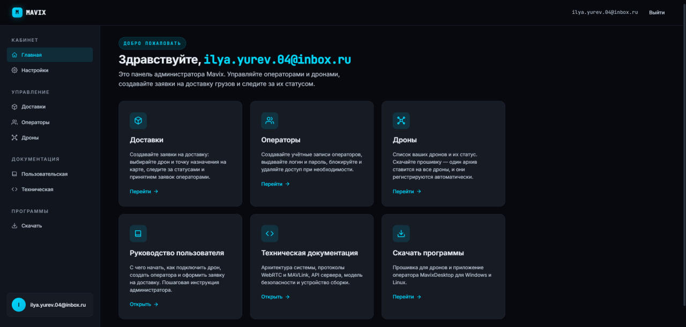
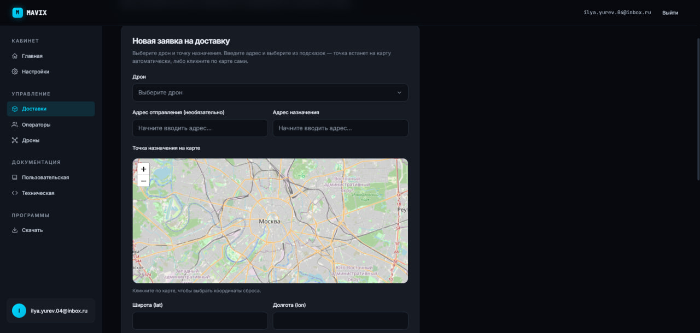
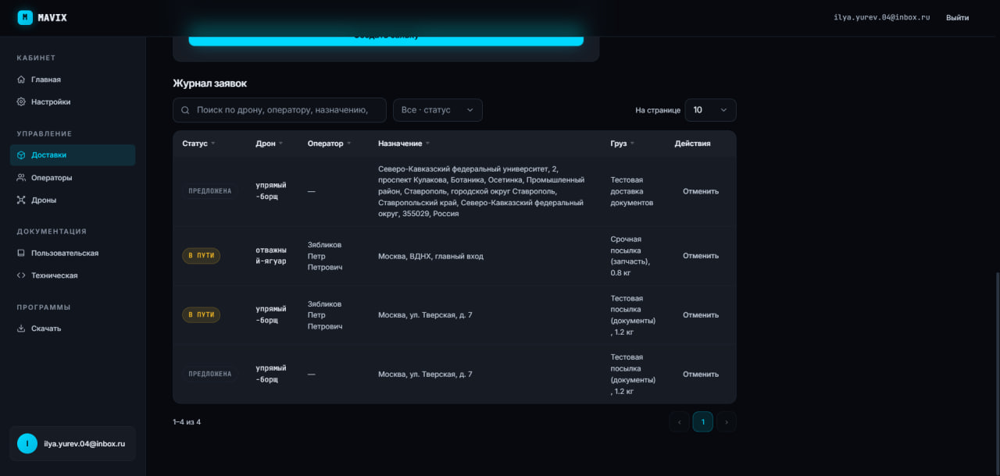
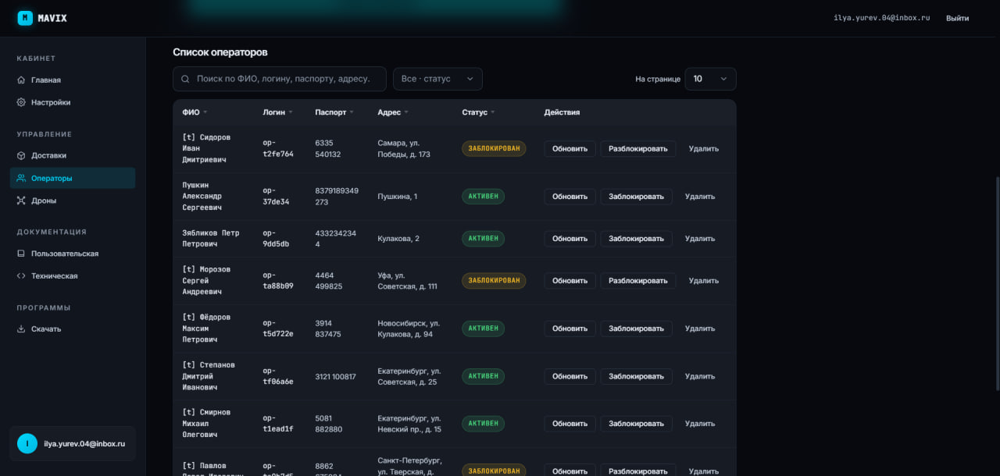
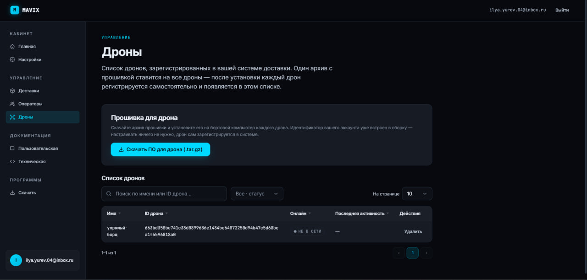
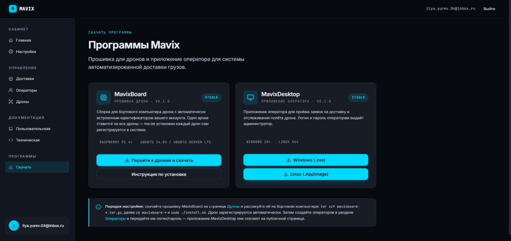
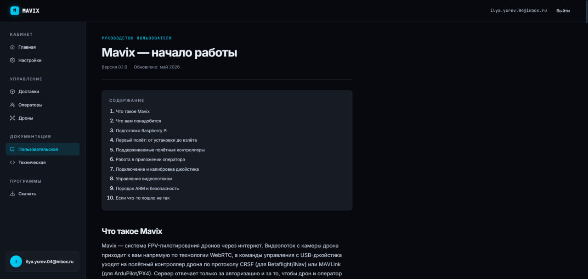

# MavixWeb

Веб-часть системы автоматизированной доставки малогабаритных грузов дронами
**Mavix**: публичный лендинг, кабинет администратора (операторы, дроны, заявки на
доставку, журнал), страницы скачивания дистрибутивов и документации.

## Скриншоты

| Главная (лендинг) | Личный кабинет |
|---|---|
|  |  |

| Создание заявки на доставку | Журнал доставок |
|---|---|
|  |  |

| Операторы | Дроны |
|---|---|
|  |  |

| Загрузка приложений | Руководство пользователя |
|---|---|
|  |  |

## Стек
Node.js (Express) — статика и прокси к API · ванильный JavaScript (модули-IIFE) ·
HTML/CSS · Leaflet + Nominatim (карта/адрес). Тесты — Jest.

## Быстрый старт
```bash
npm install
npm start        # слушает PORT из .env, проксирует /api на MavixServer
```

## Переменные окружения (`.env`)
`PORT` — порт MavixWeb; `SERVER_URL` — базовый URL MavixServer (без хвостового `/`),
напр. `http://localhost:8000`.

## Тесты
```bash
npm test         # Jest — полный набор зелёный
```

## Документация
- [TECHNICAL.md](TECHNICAL.md) — техническое описание (ГОСТ 19.402): структура,
  кабинет, карта/геокодирование, особенности реализации.
- [USER_GUIDE.md](USER_GUIDE.md) — руководство администратора (ГОСТ 19.505):
  операторы, дроны, заявки, журнал.
- Обзор всей системы — корневой [README.md](../README.md).
