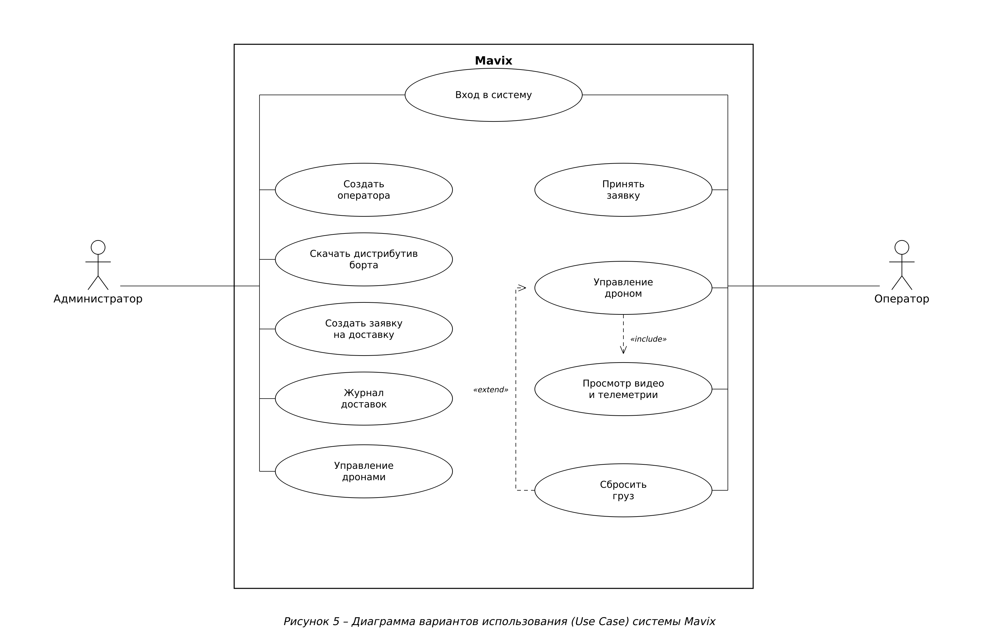
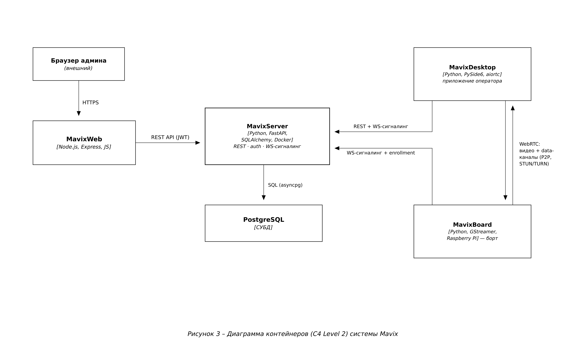

# MavixWeb — Техническое описание

Документ составлен по ГОСТ 19.402-78 «Описание программы» (ЕСПД).

## 1. Аннотация

MavixWeb — веб-часть системы доставки грузов дронами Mavix: публичный лендинг,
кабинет администратора (управление операторами, дронами, заявками на доставку,
журнал), страницы скачивания дистрибутивов и документации. Серверная часть на
Node.js/Express отдаёт статику и проксирует REST API MavixServer.

## 2. Общие сведения

- **Наименование:** MavixWeb.
- **Стек:** Node.js (Express) — раздача статики и прокси к API; фронтенд —
  ванильный JavaScript (модули-IIFE, без фреймворка), HTML, CSS; карта выбора
  точки — Leaflet, обратное геокодирование — Nominatim. Тесты — Jest.
- **Связь:** обращается к REST API MavixServer (JWT в заголовке).

## 3. Функциональное назначение

- Лендинг и страницы документации/скачивания (десктоп, борт).
- Регистрация/вход администратора; кабинет:
  - **Операторы** — создание (логин/пароль генерируются), список, удаление.
  - **Дроны** — список, удаление.
  - **Доставки** — создание заявки (дрон + адрес/координаты/точка на карте),
    журнал доставок со статусами.
- Выбор точки доставки на карте (Leaflet) с автозаполнением адреса (Nominatim).

## 4. Описание логической структуры

Express-сервер (`server`) раздаёт `public/` и проксирует `/api` на MavixServer.
Фронтенд: страницы `public/*.html` + модули `public/js/pages/*.js` (deliveries,
operators, drones, cabinet) и переиспользуемые компоненты (`data-table.js`,
кастомный дропдаун, формы). Роли: кабинет доступен только администратору.

Сценарии (Use Case) и место MavixWeb среди контейнеров:




## 5. Используемые технические средства

Node.js 18+ (Express). Браузер с поддержкой ES2017+. Внешние сервисы: Nominatim
(обратное геокодирование, клиентская сторона), тайлы карты OSM.

## 6. Установка и настройка

```bash
npm install
npm start                 # по умолчанию слушает порт из .env (PORT)
```
Переменные окружения (`.env`): `PORT` — порт MavixWeb; `SERVER_URL` (или
аналог) — базовый URL MavixServer (без хвостового `/`), напр.
`http://localhost:8000` при локальной разработке.

## 7. Проверка работы

```bash
npm test                  # Jest — полный набор зелёный
```

## 8. Сообщения системному программисту

- Пустой кабинет / 401 → проверить вход администратора и доступность API
  (`SERVER_URL`).
- Карта/адрес не подгружаются → проверить доступ к тайлам OSM и Nominatim
  (нужен интернет на клиенте), а также корректный `User-Agent`.

## 9. Журналирование

Express логирует обращения и ошибки прокси в stdout. Клиентские ошибки —
в консоли браузера. Человекочитаемый текст интерфейса — на русском.

## 10. Особенности реализации

- **Кастомный выпадающий список** выбора дрона: нативный `<select>` нельзя
  кросс-браузерно перекрасить (синий системный hover), поэтому он скрыт, а
  поверх отрисован свой `.dd` со «серым» hover, как в сайдбаре; значение
  по-прежнему сабмитится нативным `<select>`.
- **Автозаполнение адреса**: клик по точке на карте (Leaflet) запускает обратное
  геокодирование Nominatim и подставляет адрес в поле «адрес назначения».
- **Карточки ПО**: выравнивание бейджей ОС у карточек разной высоты — через
  `flex` (блок meta+actions прижат к низу).
